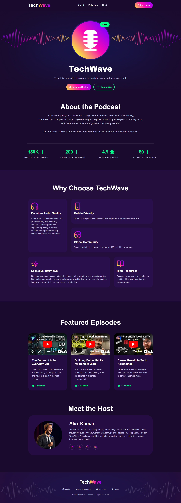

<div align="center">

   
# 🎙️ TechWave - Professional Tech Podcast
### *Riding the Current of Innovation & Technology.*

[]()
[]()
[]()

*TechWave is a high-performance, dark-themed landing page designed to showcase tech podcasts. Featuring sleek animations, structured episode grids, and a seamless user experience.*

</div>

---

### 📸 Project Preview


---

### 📝 Project Overview
TechWave is built using modern CSS principles to handle complex layouts like featured episode grids and host profiles. It emphasizes clean typography, vibrant gradients, and intuitive navigation to keep users engaged with the content.

### ✨ Key Features
- **Modern Dark UI:** Premium aesthetic with professional color palettes and gradients.
- **Fully Responsive:** Seamlessly transitions across mobile, tablet, and desktop screens.
- **Featured Episodes:** Structured grid layout for showcasing top-performing content.
- **Host Profile Section:** Dedicated section to build trust with the audience.
- **Social Integration:** Quick links to podcast platforms like Spotify and YouTube.

### 🛠️ Technology Stack
- **HTML5:** For semantic structure and SEO optimization.
- **CSS3:** Custom styles including Flexbox and Grid for responsive layouts.
- **Asset Optimization:** High-quality imagery and icons managed via the `/assets` folder.

### 🚀 How to Run Locally
1. **Clone the repository:**
   ```bash
   git clone [https://github.com/fireflyurmi/TechWave.git](https://github.com/fireflyurmi/TechWave.git)
